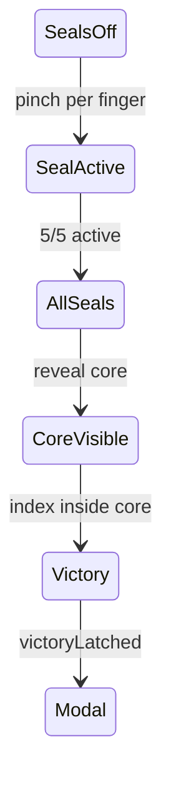

# Game 1 — The Threshold

**Fase:** `phase-01`  
**Estado:** implementado  
**Ruta dev:** `/play/1`  
**Código:** `src/game/environments/phase-01-threshold/`

---

## Objetivo del juego

Introducir el vocabulario de **cinco dedos** y el gesto **pinch simétrico** (unir yemas homónimas de ambas manos). Tras activar los cinco sellos, aparece un **núcleo central**; el jugador debe meter el **índice** en el núcleo para completar la fase.

**Victoria:** toque del índice en el core orb con los cinco sellos ya activos → modal → Game 2.

---

## Dinámicas

### Dinámica A — Activación de sellos (pinch)

| Aspecto | Detalle |
|---------|---------|
| **Qué hace el jugador** | Con ambas manos visibles, acerca las yemas del mismo dedo (pulgar con pulgar, índice con índice, etc.). |
| **Objetivo** | Conmutar `interactions[finger].active` a `true` para los **cinco** dedos. |
| **Feedback** | Orbes 3D en arco se iluminan según proximidad de yema o estado `active`; portal central carga color. |
| **Dónde vive la lógica** | `GameSessionProvider.tickInteractions()` — **global**, no en el entorno. |

**Umbrales** (`modules/hand-engine/core/constants.ts`):

- `TOUCH_ON_THRESHOLD` / `TOUCH_OFF_THRESHOLD` — distancia world entre yemas simétricas.
- `TOGGLE_COOLDOWN_MS` — evita rebotes.

### Dinámica B — Proximidad visual a sellos

| Aspecto | Detalle |
|---------|---------|
| **Qué hace el jugador** | Acerca yemas a los orbes de sellos (sin pinch obligatorio para brillo). |
| **Objetivo** | Feedback de `activation` 0–1 por sello (`PROXIMITY_RADIUS = 0.09` world). |
| **Feedback** | Escala, emissive, anillo orientado hacia yema más cercana. |

### Dinámica C — Núcleo central (índice)

| Aspecto | Detalle |
|---------|---------|
| **Condición previa** | `allSealsActive(interactions)` — los cinco dedos en `active`. |
| **Qué hace el jugador** | Lleva el **índice** (izq o der) al orb central en pantalla/espacio 3D. |
| **Objetivo** | `evaluateCoreOrbIndexTouch().inside === true` → `victoryLatched`. |
| **Feedback** | Core aparece con `reveal` lerped; color arcoíris cíclico; pulse por proximidad. |

---

## Espacio y estética

- Cámara **frontal fija** (`DEFAULT_CAMERA` en `modules/hand-engine/core/view-area.ts`).
- Niebla, grid wireframe, portal toroidal, partículas.
- Cinco sellos en arco con color `FINGER_COLORS[finger]`.
- Overlay **HandOverlay** dentro del stage (siempre visible en playing).

---

## Implementación técnica

### Archivos

| Archivo | Rol |
|---------|-----|
| `PhaseOneEnvironment.ts` | Escena Three.js, tick, runtime |
| `core-orb-touch.ts` | Probe índice ↔ núcleo |
| `index.ts` | Export factory |
| `../screen-touch.ts` | `indexProximityToWorldOrb`, proyección 2D |

### Posiciones 3D (sellos)

```typescript
SEAL_POSITIONS: Record<FingerName, THREE.Vector3>
// thumb (-0.42, 0.12, -0.08) … pinky (0.42, 0.12, -0.08)
CORE_ORB_CENTER = (0, 0.02, -0.06)
```

### Probe núcleo — `core-orb-touch.ts`

```typescript
evaluateCoreOrbIndexTouch(fingers, camera, coreCenter)
  → { proximity: 0..1, inside: boolean }

shouldTriggerCoreVictory(touch, sealsReady)
  → sealsReady && touch.inside
```

- `inside` cuando `proximity >= CORE_ORB_INSIDE_THRESHOLD` (0.08).
- Combina pantalla (`screenRadiusPx: 170`) y world (`worldRadius: 0.18`).

### Tick — orden lógico

1. Actualizar activación visual de cada sello (proximidad + `interactions[finger].active`).
2. Cargar portal según suma de activaciones.
3. Si todos los sellos activos → revelar core (`core.reveal → 1`).
4. Evaluar `evaluateCoreOrbIndexTouch` → latch victoria.
5. Actualizar `PhaseRuntimeState` (`handOverlayActive: true`).

### Registro y metadata

- `registry.ts` → `createPhaseOneEnvironment`
- `phases/types.ts` — title, subtitle
- `phases/victory-copy.ts` — texto modal

---

## Diagrama de estados



---

## Continuar / mejoras posibles

- Hint UI explícito por sello pendiente.
- Sonido al toggle pinch.
- No cambiar umbrales del probe sin actualizar animación y victoria a la vez.

---

## Referencias

- Plataforma: [../docs/03-hand-engine-and-input.md](../docs/03-hand-engine-and-input.md)
- Probes: [../docs/05-touch-probes-and-screen-space.md](../docs/05-touch-probes-and-screen-space.md)
