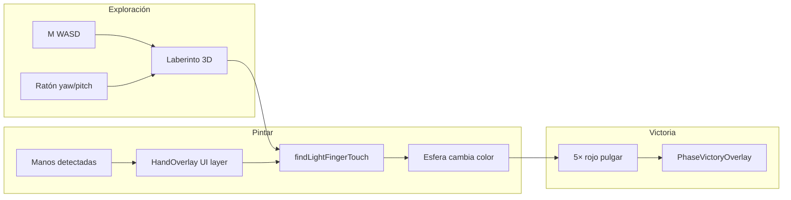

# Game 2 — The Silver Maze

**Fase:** `phase-02`  
**Estado:** implementado (pulido visual/balance pendiente)  
**Ruta dev:** `/play/2`  
**Código:** `src/game/environments/phase-02-silver-maze/`  
**Reemplaza:** Mirror Hall — **obsoleto, no implementar**

---

## Objetivo del juego

Explorar un **laberinto plateado** en **primera persona** (estilo Doom). Encontrar **cinco esferas** encastradas en paredes; al mostrar las manos en cámara, **pintar** cada esfera con el color del dedo que la toque en pantalla.

**Victoria:** las **cinco esferas en rojo** (color del pulgar, `0xff5566`) → modal → Game 3.

---

## Dinámicas

### Dinámica A — Exploración FPS

| Aspecto | Detalle |
|---------|---------|
| **Input** | `W`/`S` avance/retroceso, `A`/`D` strafe, **ratón** mira (yaw/pitch) |
| **Objetivo** | Recorrer el laberinto desde el **centro** y localizar esferas |
| **Cámara** | FPV altura ojos `EYE_HEIGHT = 1.55`, FOV 72° |
| **Colisiones** | Grid maze — 4 puntos (radio jugador) vs paredes |

El movimiento usa el **yaw** actual: W siempre avanza hacia donde miras.

### Dinámica B — Wiring de manos (overlay 2D)

| Aspecto | Detalle |
|---------|---------|
| **Cuándo** | MediaPipe detecta `left.detected` o `right.detected` |
| **Dónde se dibuja** | `PlayUiLayer` → `HandOverlay fullViewport` (encima del canvas 3D) |
| **Objetivo** | Ver skeleton + anillos de color en yemas mientras pintas |
| **Nota** | No bloquea WASD/ratón; capa `pointer-events: none` |

### Dinámica C — Pintar esferas (toque 2D)

| Aspecto | Detalle |
|---------|---------|
| **Qué hace el jugador** | Mira una esfera en el laberinto y lleva una yema al disco proyectado en pantalla |
| **Objetivo** | Esfera adopta `FINGER_COLORS[finger]` del dedo que intersecta |
| **Victoria parcial** | Cada esfera puede repintarse; cuenta solo **rojo pulgar** para win |
| **Estado inicial** | 5 colores dedo aleatorios (uno por esfera), sin repetir pool |

---

## Espacio y estética

| Elemento | Implementación |
|----------|----------------|
| Laberinto | Grid 13×13, `CELL_SIZE = 2.4`, recursive division |
| Paredes/suelo/techo | `MeshPhysicalMaterial` plateado |
| Esferas | Radio `0.13`, mitad encastrada en pared (`EMBED = 0.06`), altura `WALL_HEIGHT * 0.5` |
| Luces | `PointLight` + glow additive por esfera |
| Niebla | `FogExp2(0x121820, 0.038)` |

Spawn: celda central `(floor(cols/2), floor(rows/2))`.

---

## Implementación técnica

### Archivos

| Archivo | Rol |
|---------|-----|
| `SilverMazeEnvironment.ts` | Factory, escena, tick, victoria |
| `maze-gen.ts` | Generación laberinto, wall slots para esferas |
| `fps-controls.ts` | WASD, ratón, colisiones, cámara FPS |
| `light-touch.ts` | `findLightFingerTouch`, `allLightsRed` |
| `index.ts` | Export |

### Laberinto — `maze-gen.ts`

- `generateMaze()` — recursive division + muro exterior.
- `collectInnerWallSlots()` — puntos medios paredes interiores (normales ±X/±Z).
- `pickRandomSlots(slots, 5)` — colocación esferas.

### FPS — `fps-controls.ts`

- `createFpsInput()` en **mount** del entorno; `attach()` a listeners `document`.
- `registerFpsLookInput` / `getFpsLookInput` — singleton para el tick.
- `tickFpsMovement(player, maze, input, dt)` — look + WASD cada frame.
- `applyFpsCamera(camera, player)` — rotación orden `YXZ`.
- Pointer lock opcional en `mousedown` (ratón también funciona sin lock vía delta client).

**Constantes:** `MOVE_SPEED = 4.2`, `MOUSE_SENS = 0.0025`, `PLAYER_RADIUS = 0.28`.

### Toque esferas — `light-touch.ts`

```typescript
findLightFingerTouch(fingers, camera, lightWorlds[], sphereRadius)
  → { lightIndex, finger, touching, proximity }
```

1. Proyecta cada esfera; skip si detrás de cámara (`z > 1`).
2. `worldToMirroredScreen` → centro disco en coords stage.
3. `sphereScreenRadiusPx()` — radio en px según distancia y FOV.
4. Cualquier dedo visible dentro del disco → `touching`, aplica color.

Victoria en tick:

```typescript
allLightsRed(lights.map(l => l.color)) → victoryLatched
```

### UI — `GameShell.tsx`

```typescript
isSilverMaze = currentPhaseId === "phase-02"
showHandInEngine = showGame && !isSilverMaze  // sin overlay dentro del stage
hands slot = HandOverlay fullViewport visible={handsOnScreen}
```

### Runtime

- `handOverlayActive: handsVisible` (informativo).
- `statusHint` guía WASD / manos / pulgar rojo.

---

## Diagrama



---

## Pendiente / pulido

- Materiales shader más ricos (normals, environment).
- Balance radio disco / sensibilidad.
- Sonido pasos o buzz al pintar.
- Gating: no acceder a `/play/2` sin completar Game 1 (prod).

---

## Obsoleto — Mirror Hall

Scaffold eliminado. Espejos + puente de índices **no** forman parte del producto.

---

## Referencias

- UI capas: [../docs/02-ui-layers-and-overlays.md](../docs/02-ui-layers-and-overlays.md)
- Probes 2D: [../docs/05-touch-probes-and-screen-space.md](../docs/05-touch-probes-and-screen-space.md)
