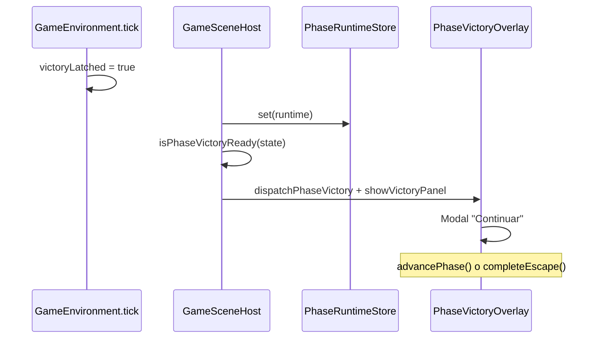

# Sesión y flujo global

## Ciclo de vida

```
lobby → playing (phase-01 … phase-04) → finale → ended
```

| Estado | `EscapeSessionStatus` | Qué ve el jugador |
|--------|----------------------|-------------------|
| Lobby | `lobby` | Banner: cámara + **Start Game N** |
| Jugando | `playing` | Escena 3D + HUD + overlay manos (según fase) |
| Final | `finale` | Confetti + pantalla “You escaped” |
| Terminado | `ended` | Banner de fin de sesión |

Definido en `src/game/session/types.ts`. Gestionado por `GameSessionProvider` (`src/game/react/GameSessionProvider.tsx`).

## Rutas de desarrollo

| URL | Fase | Entorno |
|-----|------|---------|
| `/play` | Hub | Enlaces a los 4 juegos |
| `/play/1` | `phase-01` | The Threshold |
| `/play/2` | `phase-02` | The Silver Maze |
| `/play/3` | `phase-03` | The Star Maze |
| `/play/4` | `phase-04` | The Elemental Orrery |

- `PlayGamePage` pasa `initialPhaseId` a `PlayProviders` → `GameSessionProvider`.
- **Start Game N** llama `startSession()`: pone `sessionStatus = "playing"` y resetea interacciones de dedos.
- Sin gating de progreso por ahora (cualquier `/play/N` es accesible).

## Flujo de victoria (todas las fases)



1. El entorno 3D **latchea** `victoryLatched: true` en el mismo frame que el feedback visual.
2. `GameSceneHost` copia el runtime al store cada RAF.
3. Si `victoryLatched || phaseComplete` → `dispatchPhaseVictory(phaseId)` + `showVictoryPanel()`.
4. `PhaseVictoryOverlay` muestra copy de `phases/victory-copy.ts`.
5. **Continuar:**
   - Fases 1–3: `advancePhase()` → siguiente `currentPhaseId`, recarga entorno.
   - Fase 4: `completeEscape()` → `sessionStatus = "finale"`.

Archivos clave:

- `src/game/events/phase-victory.ts`
- `src/game/victory/detect-victory.ts`
- `src/components/PhaseVictoryOverlay/PhaseVictoryOverlay.tsx`
- `src/components/EscapeFinaleScreen/`, `ConfettiLayer/`

## Providers (orden en `/play`)

```
HandEngineProvider
  → GameSessionProvider (initialPhaseId)
    → PhaseRuntimeProvider
      → GameShell
```

- **HandEngine:** cámara, MediaPipe, `FingersFrame`.
- **GameSession:** fase actual, pinch toggles, modal victoria.
- **PhaseRuntime:** snapshot del HUD (`progress`, `statusHint`, `handOverlayActive`, …).

## Pinch global (GameSession)

En cada frame del host 3D se llama `tickInteractions()`:

- Para cada dedo, distancia simétrica entre yemas izq/der (`symmetricTipDistance`).
- Si ambas manos detectadas y distancia &lt; umbral → toggle `interactions[finger].active` (con cooldown).
- Usado en Game 1 (sellos). Game 3 usa solo los índices y no depende del pinch global.

Constantes: `TOUCH_ON_THRESHOLD`, `TOUCH_OFF_THRESHOLD`, `TOGGLE_COOLDOWN_MS` en `modules/hand-engine/core/constants.ts`.
